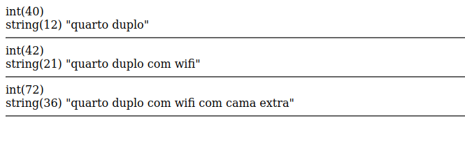

# DesignPaterns - Decorator

## O arquivo Main.php é o arquivo de teste 
### Para testar voçê pode usar o docker para subir um servidor utilizando o seguinte comando dentro da pasta Design Patterns:

``docker run -d -p 3000:80 --name my-apache-php-app -v "$PWD":/var/www/html php:8.0-apache``

### Você pode verificar se o container está de pé, usando o comando do docker:
``docker ps -a``

### Agora basta digitar em seu navegador: 

http://localhost:3000/decorator/Main.php

Implementação baseada no seguinte reposiorio: https://github.com/DesignPatternsPHP/DesignPatternsPHP